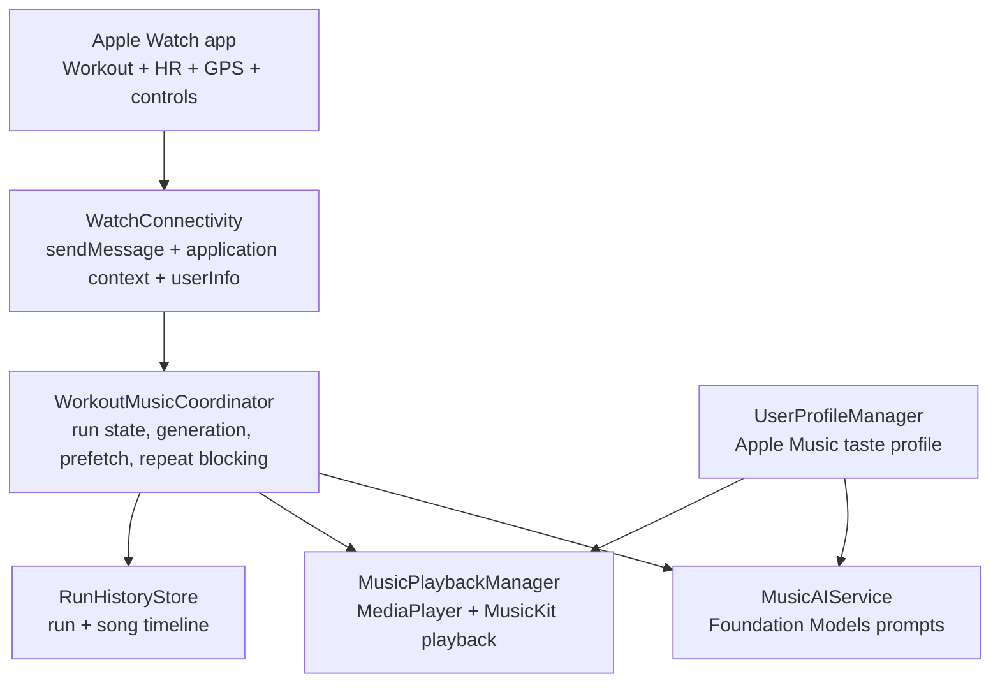

# Pancake

Pancake is an iPhone + Apple Watch running assistant that picks the next song for a run based on the runner's music taste, workout plan, current segment intensity, and live effort signals like heart rate. It is built as a real iOS product, not a demo shell: it uses SwiftUI, WatchConnectivity, HealthKit, CoreLocation, MusicKit, MediaPlayer, Foundation Models, local persistence, background audio, and a first-run onboarding flow.

The core product idea is simple: runners should not have to manage a playlist mid-run. Pancake learns what they like, watches what the run is asking of them, and keeps music moving toward the intended effort.

## Product Highlights

- Apple Watch guided runs with structured segments, live heart-rate updates, GPS distance, segment haptics, and phone handoff.
- iPhone-hosted music intelligence that generates and plays songs from Apple Music or the user's local library.
- Apple Music taste setup that imports artists, songs, genres, and playlist samples as preference signals, not as a fixed playback queue.
- Deterministic no-repeat protection during a run, including normalized title/artist matching across model output and actual playback metadata.
- Prefetched next-song pipeline for low-latency manual song rejection from the watch.
- Background-audio support and durable WatchConnectivity fallbacks for locked-phone runs.
- First-run onboarding that walks through account, Health, Location, Music, Song Check, and Watch setup.
- Sign in with Apple state validation that handles revoked credentials instead of trusting stale local flags.

## Architecture



Pancake is intentionally coordinator-driven. The watch owns the workout experience, while the iPhone owns song generation and playback. That separation keeps watchOS lightweight and lets the phone handle Foundation Models, Apple Music catalog search, MediaPlayer queues, and background audio.

## Tech Stack

- Swift 5
- SwiftUI
- WatchConnectivity
- HealthKit
- CoreLocation
- MusicKit
- MediaPlayer
- AVFoundation
- Foundation Models
- Sign in with Apple
- Xcode project with iPhone and watchOS targets

## Notable Engineering

### 1. Song generation is serialized, prefetched, and run-aware

[WorkoutMusicCoordinator.swift](Pancake/WorkoutMusicCoordinator.swift#L329-L407) separates automatic next-song generation from user-requested "new song" generation. Both paths share the same resolver, but the user path first consumes a prefetched candidate for a faster watch interaction.

[WorkoutMusicCoordinator.swift](Pancake/WorkoutMusicCoordinator.swift#L425-L465) keeps a small prefetch queue warm in the background. This is a product-driven performance decision: rejecting a song during a run should feel immediate.

[WorkoutMusicCoordinator.swift](Pancake/WorkoutMusicCoordinator.swift#L648-L672) adds a single-flight generation lock and automatic cooldown so segment changes, song-end checks, and playback state noise cannot stack multiple transitions at once.

Why it is strong: this is the kind of defensive state management a real workout app needs. It anticipates asynchronous timers, watch messages, model latency, and MediaPlayer state changes happening at the same time.

### 2. Repeats are blocked deterministically, not just prompt-discouraged

[WorkoutMusicCoordinator.swift](Pancake/WorkoutMusicCoordinator.swift#L526-L610) checks normalized played/unavailable song keys before playback, retries suggestions, and falls back to a playable library/catalog choice when generation misses.

[MusicModels.swift](Pancake/Models/MusicModels.swift#L470-L520) normalizes title and artist identity across model suggestions and actual played songs. This collapses variants like live versions, remasters, bracketed text, punctuation, and "Song by Artist" formatting.

Why it is strong: LLM prompts are not a guarantee. Pancake treats the model as a suggestion engine and puts deterministic correctness around it.

### 3. Foundation Models prompts are transparent and product-specific

[MusicAIService.swift](Pancake/Services/MusicAIService.swift#L769-L880) builds structured prompt previews for interval transitions. The prompt balances taste, planned effort, live metrics, heart-rate drift, playback constraints, and current workout context.

[PromptLabView.swift](Pancake/PromptLabView.swift#L1-L180) and [PromptLabViewModel.swift](Pancake/ViewModels/PromptLabViewModel.swift#L122-L150) expose a "Song Check" lab so the recommendation path can be tested without going on a run.

Why it is strong: AI behavior is inspectable and testable. A reviewer can see exactly how the prompt is assembled and can validate Apple Music playback independently of the watch workout flow.

### 4. Apple Music import is taste modeling, not playlist playback

[UserProfileManager.swift](Pancake/UserProfileManager.swift#L145-L200) fetches Apple Music playlists and imports songs, artists, and genres into a taste profile.

[MusicRecommendationPolicy.swift](Pancake/MusicRecommendationPolicy.swift#L88-L129) separates manual favorites from imported playlist signals, keeping playlist data as supporting taste context rather than treating it as a queue.

Why it is strong: this preserves the core product promise. Pancake generates songs from run goals and live state; Apple Music data teaches preference, it does not dictate playback order.

### 5. Playback has real failure handling

[MusicPlaybackManager.swift](Pancake/MusicPlaybackManager.swift#L53-L97) includes an emergency fallback path that keeps the run moving when a generated suggestion cannot be played.

[MusicPlaybackManager.swift](Pancake/MusicPlaybackManager.swift#L101-L145) verifies catalog access, searches for credible matches, applies now-playing state, and resets playback time when a song starts.

Why it is strong: a running app cannot leave the user stuck because one catalog result was unavailable. The code handles local-library playback, catalog playback, unavailable songs, and state synchronization explicitly.

### 6. Watch-to-phone communication is resilient

[WatchConnectivityWrapper.swift](Pancake/WatchConnectivityWrapper.swift#L109-L131) sends immediately when reachable and falls back to durable delivery when the watch is not reachable.

[WatchConnectivityWrapper.swift](Pancake/WatchConnectivityWrapper.swift#L176-L230) centralizes incoming watch messages into app notifications for workout control, updates, heart rate, segment changes, and playback.

[WorkoutSessionManager.swift](<Pancake Watch Watch App/WorkoutSessionManager.swift#L442-L497>) sends sanitized workout snapshots and uses application context or user info when immediate messaging is unavailable.

Why it is strong: real watch connectivity is not always synchronous, especially when the phone is locked. Pancake treats reachability as a performance optimization, not a correctness dependency.

### 7. Onboarding is task-based and App Store-friendly

[OnboardingView.swift](Pancake/OnboardingView.swift#L11-L64) presents a setup guide instead of dumping users into raw permission prompts.

[OnboardingView.swift](Pancake/OnboardingView.swift#L127-L207) walks through Apple Music playback, library taste import, Song Check, and watch readiness.

[OnboardingManager.swift](Pancake/OnboardingManager.swift#L93-L115) computes readiness from existing managers instead of duplicating permission logic.

Why it is strong: onboarding is integrated with actual product readiness. It shows progress, allows exploration, and blocks only what truly needs to be ready before a run.

### 8. Account state is validated against Apple, not just local storage

[AuthManager.swift](Pancake/AuthManager.swift#L59-L78) handles Sign in with Apple button results directly and observes Apple credential revocation notifications.

[AuthManager.swift](Pancake/AuthManager.swift#L127-L153) checks the persisted Apple user identifier with `ASAuthorizationAppleIDProvider.getCredentialState` and clears sign-in state when credentials are revoked, transferred, or missing.

[ContentView.swift](Pancake/ContentView.swift#L25-L33) validates that credential state on launch and whenever the app returns to the foreground.

Why it is strong: App Store builds cannot treat a persisted boolean as authentication. Pancake now re-checks Apple as the source of truth and fails safely back to sign-in when access is revoked.

## User Flow

1. Open Pancake and complete the setup guide.
2. Sign in with Apple.
3. Grant Health and Location access for run tracking.
4. Connect Apple Music playback and import library taste.
5. Use Song Check to generate and play a song before running.
6. Plan a run on iPhone.
7. Start the workout on Apple Watch.
8. Pancake generates songs, avoids repeats, adapts to effort, and keeps playback running with the phone locked.

## Project Structure

```text
Pancake/
  ContentView.swift                  Main iPhone shell, tabs, run setup, history
  OnboardingView.swift               First-run setup guide
  OnboardingManager.swift            Setup readiness state
  WorkoutMusicCoordinator.swift      Main workout/music orchestration
  MusicPlaybackManager.swift         Local library + Apple Music playback
  MusicKitService.swift              MusicKit catalog access
  Services/MusicAIService.swift      Foundation Models prompt generation
  MusicRecommendationPolicy.swift    Taste, heart-rate, fallback policy logic
  UserProfileManager.swift           Profile and Apple Music taste import
  AuthManager.swift                   Sign in with Apple + credential validation
  PromptLabView.swift                Song Check test surface
  WatchConnectivityWrapper.swift     iPhone WatchConnectivity boundary

Pancake Watch Watch App/
  WorkoutSessionManager.swift        Watch workout, HealthKit, location, snapshots
  ConnectedMusicControlView.swift    Watch play/stop/new-song control
  WorkoutProgressView.swift          Watch workout progress UI

Tests/
  MusicRecommendationPolicyRegression.swift
```

## Running The App

Requirements:

- Xcode 17 or newer
- iPhone target capable of iOS 26 APIs used by the project
- Apple Watch target capable of watchOS 26 APIs used by the project
- Apple Music access for catalog playback testing
- Apple Intelligence / Foundation Models availability for AI generation

Build from the command line:

```bash
DEVELOPER_DIR=/Applications/Xcode.app/Contents/Developer \
xcodebuild \
  -scheme Pancake \
  -project Pancake.xcodeproj \
  -configuration Debug \
  -destination 'generic/platform=iOS' \
  -derivedDataPath /tmp/PancakeDerivedData \
  build \
  CODE_SIGNING_ALLOWED=NO \
  ENABLE_PREVIEWS=NO
```

For full manual testing, install on a real iPhone and Apple Watch. Simulator testing is useful for UI review, but HealthKit, MusicKit playback, watch reachability, background audio, and Apple Music authorization need device validation.

## Testing

The current lightweight regression harness lives in [Tests/MusicRecommendationPolicyRegression.swift](Tests/MusicRecommendationPolicyRegression.swift#L1-L165). It covers:

- heart-rate smoothing
- heart-rate trend detection
- stable HR mismatch detection
- taste-profile priority
- fallback song selection
- repeat-key normalization

This is intentionally focused on high-risk recommendation logic. The next meaningful test investment would be a real XCTest target around onboarding readiness, playback matching, and coordinator transition locking.

## Current Production Boundaries

Implemented:

- first-run onboarding
- Apple Music taste import
- AI prompt generation
- Song Check
- watch-driven run control
- generated playback
- no-repeat song protection
- background audio hardening
- Sign in with Apple credential validation

Intentionally hidden for beta:

- Friends/social running client prototype
- local notification preview
- spoken comment playback prototype

Requires backend/APNs before production marketing:

- notifying friends when a runner starts a live run
- delivering comments between users
- friend graph and invitations
- server-side push token registration
- moderation/reporting controls for social comments

## Why This Project Matters

Pancake demonstrates product judgment and systems thinking across a modern Apple stack. The interesting work is not just "call an AI model and play a song." The hard parts are the product details around latency, permissions, watch communication, playback failure modes, repeat prevention, privacy boundaries, and keeping the runner's experience simple while a lot of asynchronous machinery runs underneath.

That is the kind of engineering I wanted this project to show.
