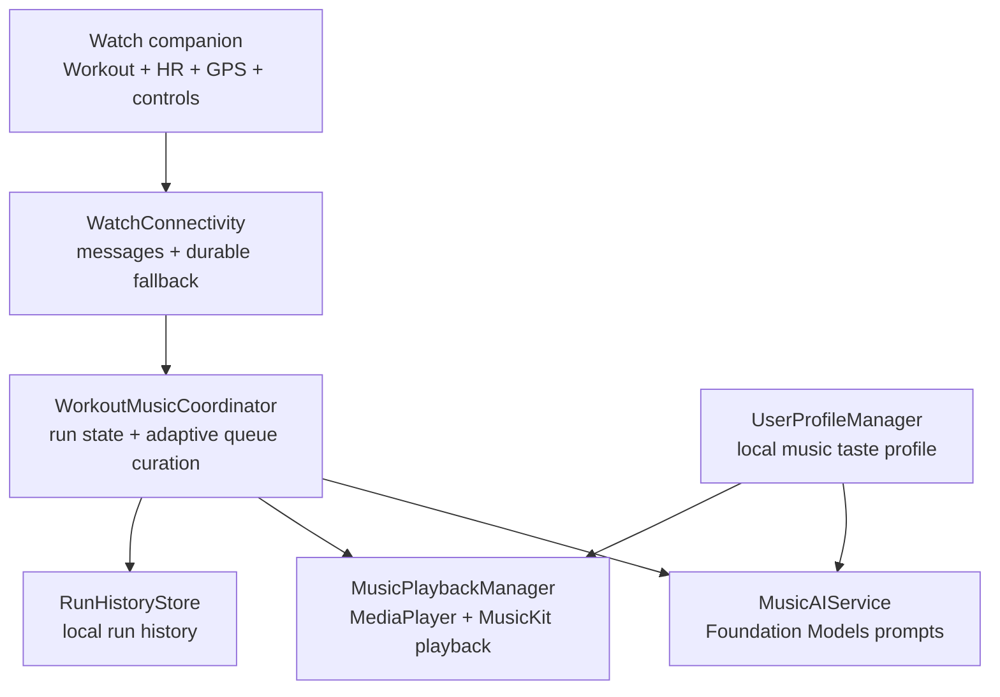

# Pancake

Pancake is an iPhone running assistant with a watch companion. Runners create structured workout plans on iPhone, follow guided outdoor segments from the paired watch, and optionally start an Adaptive Mix shaped by the plan, live effort, and music taste.

## Product Highlights

- Watch-guided outdoor runs with structured segments, heart-rate updates, GPS distance, pace, and segment haptics.
- Optional iPhone-hosted Adaptive Mix queues using on-device Foundation Models.
- Optional Apple Music taste import and catalog playback.
- User-initiated Adaptive Mix start, play, pause, stop, and next controls from the watch companion.
- Three upcoming songs refreshed against live metrics every 30 seconds without interrupting the active song.
- Upcoming-interval queue refresh about ten seconds before a planned segment transition.
- Local run history, profile preferences, and in-app data clearing.
- First-run setup with contextual permission requests.

## Architecture


```mermaid
flowchart TD
    Watch["Watch companion\nWorkout + HR + GPS + controls"]
    Connectivity["WatchConnectivity\nmessages + durable fallback"]
    Coordinator["WorkoutMusicCoordinator\nrun state + adaptive queue curation"]
    AI["MusicAIService\nFoundation Models prompts"]
    Taste["UserProfileManager\nlocal music taste profile"]
    Playback["MusicPlaybackManager\nMediaPlayer + MusicKit playback"]
    History["RunHistoryStore\nlocal run history"]

    Watch --> Connectivity
    Connectivity --> Coordinator
    Coordinator --> AI
    Coordinator --> Playback
    Coordinator --> History
    Taste --> AI
    Taste --> Playback
```

The watch companion owns workout tracking. The iPhone owns run planning, local history, suggestion generation, and optional playback.

## Tech Stack

- SwiftUI
- WatchConnectivity
- HealthKit
- CoreLocation on the watch companion
- MusicKit and MediaPlayer
- AVFoundation
- Foundation Models
- Local persistence

## User Flow

1. Open Pancake and review the setup guide.
2. Optionally import iPhone Health workout history.
3. Optionally connect Apple Music playback or import library taste.
4. Plan a structured run on iPhone.
5. Send the plan to the paired watch and start the workout there.
6. Optionally tap `Start Adaptive Mix` on the watch companion. The active song changes only when playback completes or the runner taps Next.
7. Complete the workout and review local history on iPhone.

## Running The App

Requirements:

- Xcode 17 or newer
- An iPhone target capable of the iOS 26 APIs used by the project
- A watch target capable of the watchOS 26 APIs used by the project
- Apple Intelligence availability for suggestion generation
- Apple Music access only when testing optional music features

Build from the command line:

```bash
DEVELOPER_DIR=/Applications/Xcode.app/Contents/Developer \
xcodebuild \
  -scheme Pancake \
  -project Pancake.xcodeproj \
  -configuration Debug \
  -destination 'generic/platform=iOS' \
  -derivedDataPath /tmp/PancakeDerivedData \
  build \
  CODE_SIGNING_ALLOWED=NO \
  ENABLE_PREVIEWS=NO
```

For full manual testing, install on a real iPhone and paired watch. HealthKit, MusicKit playback, watch reachability, and outdoor GPS behavior need device validation.

For local iPhone/watch simulator loop testing, run:

```bash
scripts/simulated_run_loop.sh
```

This boots a paired iPhone Air and Apple Watch simulator, spoofs GPS plus watch metrics, drives a watch-started Adaptive Mix run, and checks playlist refill, skip, and no-repeat behavior. See [TESTING_GUIDE.md](TESTING_GUIDE.md#local-simulator-run-loop).

## Support

See [docs/SUPPORT.md](docs/SUPPORT.md).

## Privacy

See [docs/PRIVACY_POLICY.md](docs/PRIVACY_POLICY.md).
